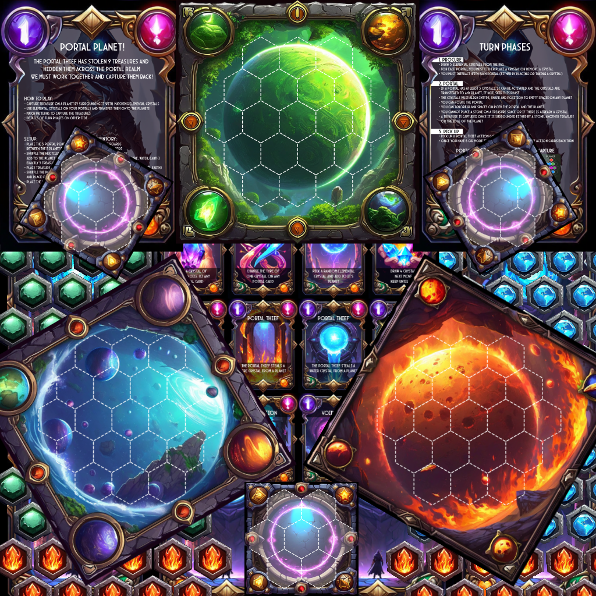
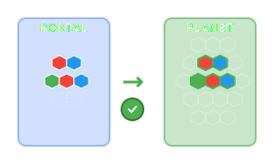
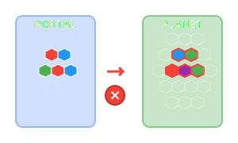
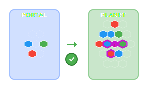
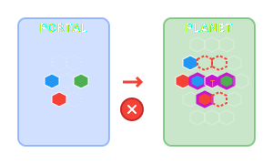

# Portal Planet

> My son had an idea of the a board game, this was a quick way of validating and then creating the assets. Using mostlye Q for Developers, AWS Bedrock for images

## How to Play

### Goal
- The portal thief has stolen 9 treasures and hidden them across the portal realm we must work together and capture them back!

### How To Play
- Capture treasure on a planet by surrounding it with  matching elemental crystals
- use elemental crystals on your portals and transfer them onto the planets
- Match patterns to capture the treasures
- See turn phases for details

### Inventory
- 3 planet boards
- 3 portal boards
- 9 treasure hex tiles
- 20 hex tiles of each (fire, water, earth)
- 9 treasure gems
- 30 elemental crystals (fire, water, earth)
- 24 portal thief action cards

### Setup
- Place the 3 portal boards between the 3 planet boards
- Shuffle the hex tiles and randomly add to the planet boards, ensure exactly 3 treasure tiles per planet
- Place treasure gems on treasure tiles
- Shuffle the portal thief action cards and place on the table
- Place the 60 elemental crystals in a bag

### Turn Phases

> 1. Procure
- Draw 3 elemental crystals from the bag
- For each portal, you must either place a crystal or remove a crystal
- You must interact with each portal (either by placing or taking a crystal)

> 2. Portal
- If a portal has at least 3 crystals, it can be activated and the crystals are transfered to any planet, if not, skip this phase
- The crystals must align intype, shape and position to empty spaces on any planet
- You can rotate the portal
- You can ignore blank spaces on both the portal and the planet
- You cannot place a stone on A treasure SPACE or if there is already a crystal
- A treasure is captured once it is surrounded either by a stone, another treasure or the edge of the planet

> 3. Pick up
- Pick up a portal thief action card and do what it says
- Once you have 6 or more treasures, pickup 2 portal thief action cards each turn

| Correct Portal Placement | Incorrect Portal Placement |
| :---: | :---: |
|  |  |

| Correct Treasure Capture | Incorrect Treasure Capture |
| :---: | :---: |
|  |  |

## Running locally

- `npm run dev`
